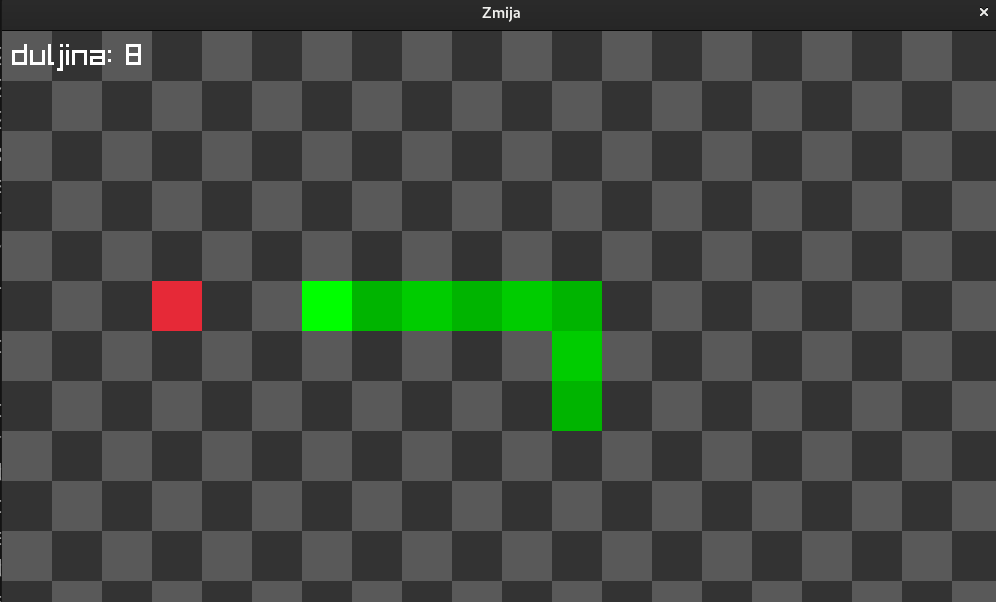

# zmija-raylib
Klasična zmija u C jeziku koristeći [raylib](https://www.raylib.com/).



## Pokretanje:
Za pokretanje je potrebno prvo instalirati [raylib](https://www.raylib.com/).
```console
$ make
$ ./zmija
```
